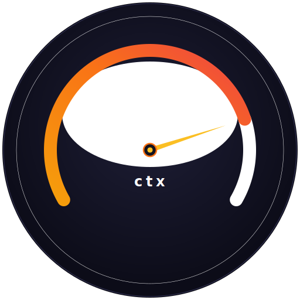

#  productive-claude

A good context window is a good Claude. These are tools for squeezing more out of every token in [Claude Code](https://docs.anthropic.com/en/docs/claude-code) — understanding what's eating your context, cutting what doesn't need to be there, and making room for what does.

This isn't plug-and-play. These are tuning tools that require investment and understanding of how Claude Code manages context under the hood.

## Contents

- 📡 **[telemetry](./telemetry/)** — Local observability for Claude Code with SigNoz + OpenTelemetry. See every trace, prompt, tool call, and raw API body without leaving your machine.
- 🎛️ **[repo-skill-manager](./repo-skill-manager/)** — Toggle team skills on and off locally so you only pay for the ones you actually use. No git noise.
